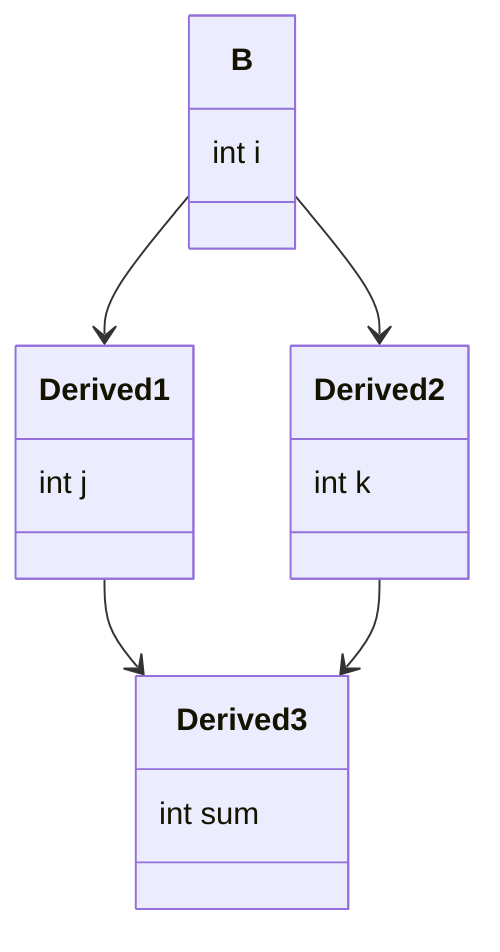

---
{"dg-publish":true,"permalink":"/courses/oop/lesson-6/"}
---

### Index 
[[Courses/OOP/Lesson 6#Moștenirea multiplă\|Moștenirea multiplă. Moștenirea în diamant]]
[[Courses/OOP/Lesson 6#Funcții virtuale\|Funcții virtuale]]
[[Courses/OOP/Lesson 6#Funcții virtuale pure\|Funcții virtuale pure]]
[[Courses/OOP/Lesson 6#Clase Abstracte\|Clase abstracte]]
[[Courses/OOP/Lesson 6#Constructori, destructori și virtualizare\|Constructori, destructori și virtualizare]]
[[Courses/OOP/Lesson 6#Downcasting\|Downcasting]]
### Moștenirea multiplă

Moștenirea din mai multe clase
- puține limbaje au moștenire multiplă
- nu e necesară --> se poate simula cu moștenire simplă 
- complicată --> probleme precum [[#Moștenirea în diamant|moștenirea în diamant]]

##### Moștenirea în diamant 

**Moștenirea în diamant** apare atunci când o clasă derivată moștenește din două clase intermediare care, la rândul lor, moștenesc din aceeași clasă de bază.

Exemplu:

```cpp
class B
{
public:
    int i;
};

class Derived1 : public B
{
public:
    int j;
};

class Derived2 : public B
{
public:
    int k;
};

class Derived3 : public Derived1, public Derived2 // contine de doua ori B
{
public:
    int sum;
};

int main()
{
    Derived3 ob;
    ob.j = 2; // merge
    ob.j = 6; // merge
    ob.i = 10; // ambiguitatea, de 2 ori i
    // orice accesare a lui i produce ambiguitate
    return 0;
}
```

Vizualizare:



**Soluția** este prin **moștenirea virtuală**.
#### Moștenirea virtuală

>[!info] 
>Moștenirea virtuală este un mecanism al C++ care permite evitarea duplicării unei clase de bază atunci când aceasta este moștenită pe mai multe căi într-o ierarhie de clase.

```cpp
class B {
public:
    int val;
};

class D1 : virtual public B { };
class D2 : virtual public B { };

class D3 : public D1, public D2 { };

int main() {
    D3 obj;
    obj.val = 10; // funcționează — este o singură variabilă val
}
```

### Funcții virtuale 

>[!info] Definiție 
>O **funcție virtuală** este o funcție membră care poate fi redefinită (overridden) într-o clasă derivată și care permite selectarea **dinamică** (***la execuție***) a versiunii corecte a funcției în funcție de tipul real al obiectului, nu după tipul declarat. (polimorfism la execuție)

Caracteristici:
- Declarate în clasa de bază cu cuvântul cheie `virtual`
- Pot fi redefinite în clasele derivate cu `override`
- La apelul prin pointer/referință de tip bază, se execută versiunea din clasa derivată 
- Permite separarea **interfeței** (în clasa de bază) față de implementare (în clasa derivată)

```cpp
class Baza {
public:
    virtual void afiseaza() {
        cout << "Funcție din clasa Baza\n";
    }
};

class Derivata : public Baza {
public:
    void afiseaza() override {
        cout << "Funcție din clasa Derivata\n";
    }
};

int main() {
    Baza* ptr;
    Derivata d;
    ptr = &d;
    ptr->afiseaza(); // → execută funcția din Derivata
}
```

Avantaje:
- programe extensibile -> codul poate fi extins fără a modifica codul existent
- reduce dependența între componente 

#### Upcasting 

Tipul derivat poate lua locul tipului de bază. Funcțiile virtuale ne permit să chemăm funcțiile pentru tipul derivat.

```cpp
#include <iostream>
enum note{C, Esharp, Eflat};

class Instrument
{
public:
    void play(note)
    {
        std::cout<<"Instrument::play"<<std::endl;
    }
};

class Winds : public Instrument
{
public:
    void play(note)
    {
        std::cout<<"Winds::play"<<std::endl;
    }
};

void tune(Instrument& instr)
{
    instr.play(note::Esharp);
}

int main()
{
    Winds trombone;
    tune(trombone); // va afisa Instrument::play
    return 0;
}
```

Dacă folosim virtual:

```cpp
class Instrument{
public:
	virtual play(note);
}

class Winds{
public:
	virtual play(note) override;
}

int main() 
{
	Winds trombone;
	tune(trombone); // va afisa chiar daca tune primeste referinta tip Instrument
}
```

#### Late binding (dynamic dispatch) 
- În C: *early binding* la apel de funcții --> apelul de funcții se rezolvă la compilare. Este utilizat tipul static.
- În C++: *late binding* (dynamic binding, runtime dispatch) --> se definește prin funcții virtuale, iar apelul de funcție se face în funcție de tipul real al obiectelor (la runtime)

Late binding --> se face prin pointeri (sau referințe), dacă funcțiile sunt apelate prin valoare, **nu există late binding.** 

```cpp
#include <iostream>
using namespace std;

class Pet { public:
    virtual string speak() const { return " "; } };

class Dog : public Pet { public:
    string speak() const { return "Bark!"; } };

int main() {
    Dog ralph;
    Pet* p1 = &ralph;
    Pet& p2 = ralph;
    Pet p3;
    // Late binding for both:
    cout << "p1->speak() = " << p1->speak() <<endl;
    cout << "p2.speak() = " << p2.speak() << endl;
    cout << "p3.speak() = " << p3.speak() << endl;
}
```

- late binding "costă"
- nu mai pot exista funcții [[Courses/OOP/Lesson 3#Funcții Inline\|inline]]

### Funcții virtuale pure 

Sintaxa:

```cpp
virtual tip_returnat nume_func(args) = 0;
```

De exemplu:

```cpp
virtual int pura(int i) = 0;
```

### Clase Abstracte

O **clasă abstractă** este o clasă ce are *cel puțin* o funcție virtuală **pură**.

Necesitate: vrem o clasă care dă doar ***interfața*** (nu vrem obiecte din clasă abstractă, ci upcasting la ea).

>[!info] Eroare la instanțiere 
>Nu pot fi definite obiecte ale unei clase abstracte.

Este permisă utilizarea de pointeri și referințe către clasa abstractă (pentru upcasting). 

>[!warning] Moștenire de la clase abstracte
>Dacă o funcție virtuală nu e suprascrisă, atunci clasa derivată rămâne **abstractă**

Altă utilitate importantă: previne **object slicing**. 

>[!danger] Overload pe funcții virtuale
>- NU este posibil overload prin schimbarea tipului de parametru de întoarcere
>- este posibil overload prin mai mulți parametri/tip diferit de parametri 

>[!proof] Excepție
> Poți **suprascrie** o funcție virtuală care întoarce un **pointer către clasa de bază** cu o funcție care întoarce un **pointer către clasa derivată**.

```cpp
class B {
public:
    virtual B* clone() const {
        return new B(*this);
    }
};

class D : public B {
public:
    D* clone() const override { // works
        return new D(*this);
    }
};
```

### Constructori, destructori și virtualizare

>[!important]
>Nu putem avea constructori virtuali.

Destructorii virtuali -> sunt uzuali. 

Dacă vrem să eliminăm porțiuni alocate dinamic și pentru clasa derivată dar facem upcasting trebuie să folosim destructori virtuali. 

```cpp
class Base {
public:
    virtual ~Base() {
        cout << "Base destructor\n";
    }
};

class Derived : public Base {
public:
    ~Derived() override {
        cout << "Derived destructor\n";
    }
};

int main() {
    Base* obj = new Derived;
    delete obj;  // Dacă ~Base() NU este virtual, ~Derived() NU se apelează!
}
```

##### Destructori virtuali puri

- recomandați dacă mai există și alte funcții virtuale 
- **trebuie** definiți în clasă (chiar dacă e clasă abstractă)
- la moștenire nu e necesar să fie redefiniți --> destructor implicit construit de compilator
- nu are efect dacă nu se face upcasting 

```cpp
class AbstractBase {
public:
	virtual ~AbstractBase() = 0;
};

AbstractBase::~AbstractBase() {}
```

>[!hint] Apel funcții virtuale în destructor
>În destructor, la apelul funcțiilor virtuale de face early binding.

```cpp
class Base { public:
  virtual ~Base() {  
	  cout << "~Base1()\n";  
	  this->f();   // early binding, de asta se afseaza Base::f()
  }
  virtual void f() { cout << "Base::f()\n"; }
};
class Derived : public Base { public:
  ~Derived() { cout << "~Derived()\n"; }
  void f() { cout << "Derived::f()\n"; }
};

int main() {
  Base* bp = new Derived; 
  delete bp; // Afis: ~Derived() ~Base1() Base::f()
}
```

### Downcasting

Este folosit în ierarhii cu clase polimorfice (în care se folosesc funcții virtuale). E problematic, dacă obiectul nu e într-adevăr derivat. 


| Tip         | Efect                  |
| ----------- | ---------------------- |
| Upcasting   | `Base*` <-- `Derived*` |
| Downcasting | `Base*` --> `Derived*` |
#### `dynamic_cast`
- safe downcast 
- funcționează doar în ierarhii polimorfice 
- runtime check cu `vtable`

```cpp
Base* b = new Derived;
Derived* d = dynamic_cast<Derived*>(b);
```

If doesn't point to a `Derived`, returns `nullptr`.

#### `static_cast`
- no runtime check --> presupune că este cast valid 
- behavior undefined if the type is wrong

```cpp
class Pet { public: virtual ~Pet(){}};
class Dog : public Pet {};
class Cat : public Pet {};

int main() {
  Pet* b = new Cat; // Upcast
  Dog* d1 = dynamic_cast<Dog*>(b); //Try to cast it to Dog*:
  Cat* d2 = dynamic_cast<Cat*>(b);// Try to cast it to Cat*:
  cout << "d1 = " << d1 << endl; // 0 -> nullptr
  cout << "d2 = " << d2 << endl; // same adress as b
cout << "b  = " << b << endl;
}
```